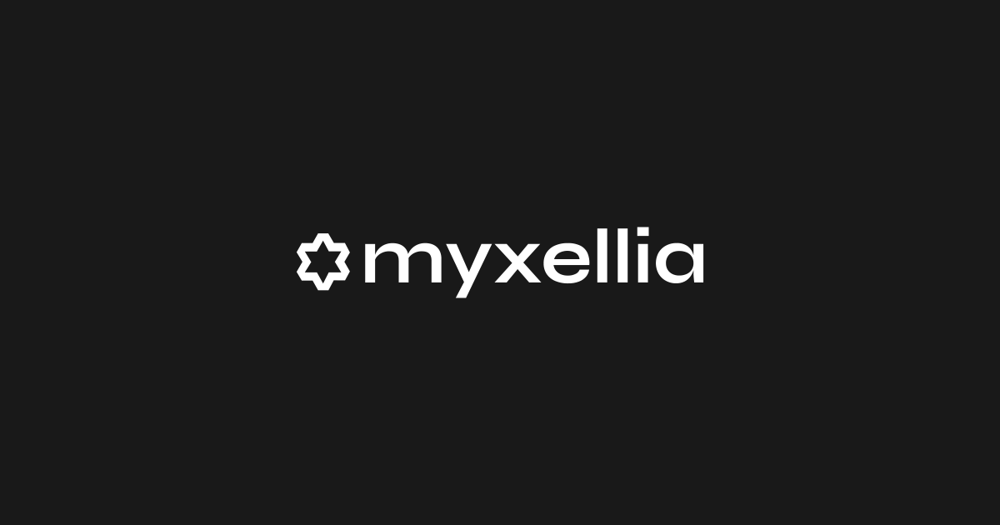

# Myxellia: Modern Financial Management Platform



Myxellia is a feature-rich, financial management application built with Next.js, TypeScript, and Tailwind CSS. This project showcases a modern, responsive, and user-friendly interface for managing personal finances. It is a portfolio project designed to demonstrate proficiency in front-end development, UI/UX design, and modern web technologies.

## Live Demo

[Link to your live demo here](https://myxellia-test-eight.vercel.app/)

## Features

- **Dashboard Overview:** A comprehensive overview of your financial health, including key metrics and charts.
- **Interactive Charts:** Visualize your income and expenses with interactive bar and area charts.
- **Budgeting Tools:** Create and manage budgets with an intuitive dialog-based interface.
- **Expense Tracking:** Easily track your expenses and categorize them for better financial insights.
- **Responsive Design:** A fully responsive layout that works seamlessly on desktop and mobile devices.
- **Modern UI/UX:** A clean and modern user interface built with Radix UI, Tailwind CSS, and Framer Motion for smooth animations.
- **Search Functionality:** Quickly search for transactions or other financial data.
- **User Authentication (placeholder):** A user navigation and avatar component, ready for a full authentication implementation.

## Tech Stack & Rationale

| Technology            | Description                                                                                                                                                            |
| :-------------------- | :--------------------------------------------------------------------------------------------------------------------------------------------------------------------- |
| **Next.js**           | Chosen for its powerful features like server-side rendering, static site generation, and API routes, which are ideal for building a fast and scalable web application. |
| **TypeScript**        | Used to add static typing to JavaScript, improving code quality, maintainability, and developer experience.                                                            |
| **Tailwind CSS**      | A utility-first CSS framework that allows for rapid UI development and a highly customizable design system.                                                            |
| **Radix UI**          | Provides a set of unstyled, accessible components that serve as a foundation for building a high-quality and consistent design system.                                 |
| **Framer Motion**     | A production-ready motion library for React that enables the creation of fluid and engaging animations.                                                                |
| **Recharts**          | A composable charting library that makes it easy to create beautiful and interactive charts.                                                                           |
| **Lucide React**      | A comprehensive and well-designed icon library that enhances the user interface.                                                                                       |
| **ESLint & Prettier** | Used for code linting and formatting to ensure code quality and consistency across the project.                                                                        |

## Architectural Decisions

- **Component-Based Architecture:** The application is built using a component-based architecture, which promotes reusability and maintainability. Components are organized into `shared` and `ui` directories, separating general-purpose components from application-specific ones.
- **Folder Structure:** The project follows a clean and organized folder structure, with clear separation of concerns between pages, components, hooks, and utility functions.
- **State Management:** For this project, we've relied on React's built-in state management capabilities (`useState`, `useContext`). For a larger application, a more robust state management library like Redux or Zustand would be considered.

## Installation and Running

1.  **Clone the repository:**
    ```bash
    git clone https://github.com/mikelisrael/myxellia-test.git
    cd myxellia
    ```
2.  **Install dependencies:**
    ```bash
    pnpm install
    ```
3.  **Run the development server:**
    ```bash
    pnpm dev
    ```

Open [http://localhost:3000](http://localhost:3000) in your browser to see the application.

## Future Improvements

- **Full User Authentication:** Implement a complete authentication system with a backend service to allow users to sign up, log in, and manage their accounts.
- **Database Integration:** Connect the application to a database (e.g., PostgreSQL, MongoDB) to persist user data.
- **API Integration:** Connect to a financial data API (e.g., Plaid) to allow users to link their bank accounts and automatically import transactions.
- **Testing:** Write unit and integration tests to ensure the application is robust and reliable.

## Contact

Michael Israel - israelipinkz@gmail.com - [Portfolio](https://mikelisrael.vercel.app)
